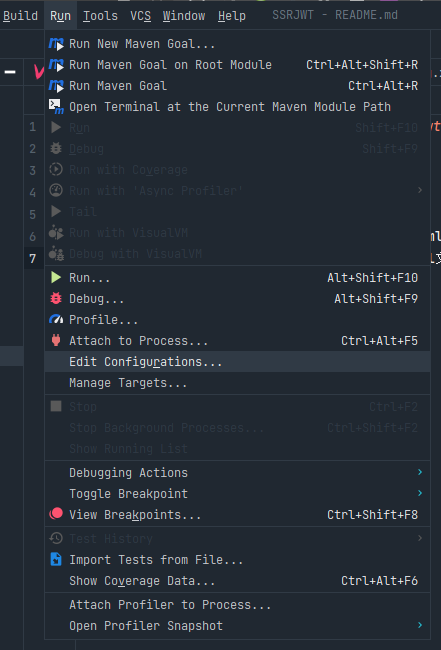
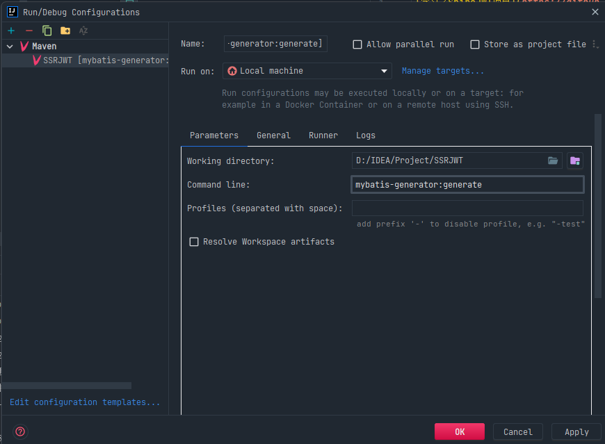

[学习了ShiroJWT项目](https://github.com/dolyw/ShiroJwt)

环境搭建：
- 1、执行sql/MySQL.sql脚本
- 2、引入相关依赖，尤其是mybatis-generator的plugin
- 3、在resources/generator文件下创建generatorConfig.xml文件
- 4、在resources/generator文件下创建mybatis-config.xml文件
- 5、运行逆向工程

```注：如果你使用的是其他版本的mysql驱动，那么插件中依赖的mysql版本也要在pom中更改```

点击run -> edit configurations -> +号 -> maven


按照如下输入（working directory是自己的模块名）


点击绿色三角形运行，即可生成逆向工程代码（由于会用到tk-mybatis框架，
所以没有在自动生成的文件中实现任何查询）


在dto类中使用到了serialVersionUID，这个其实是自动生成的（就算不写，也会自动生成）
[IDEA自动生成serialVersionUID](https://www.jianshu.com/p/5dfa065b7890)